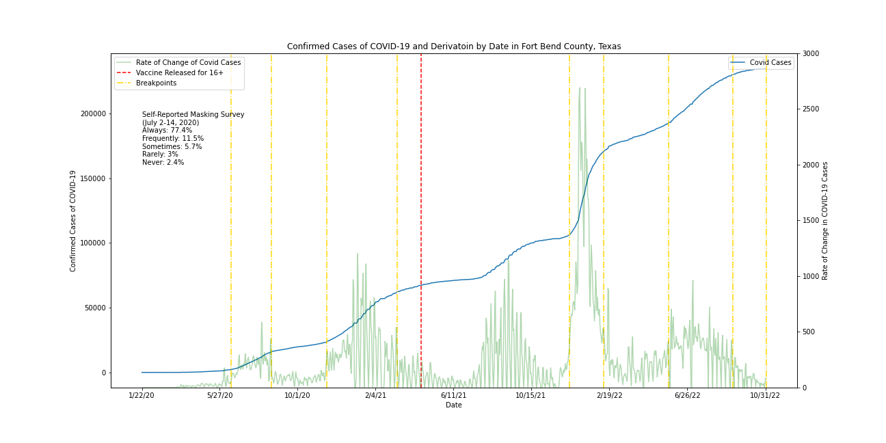
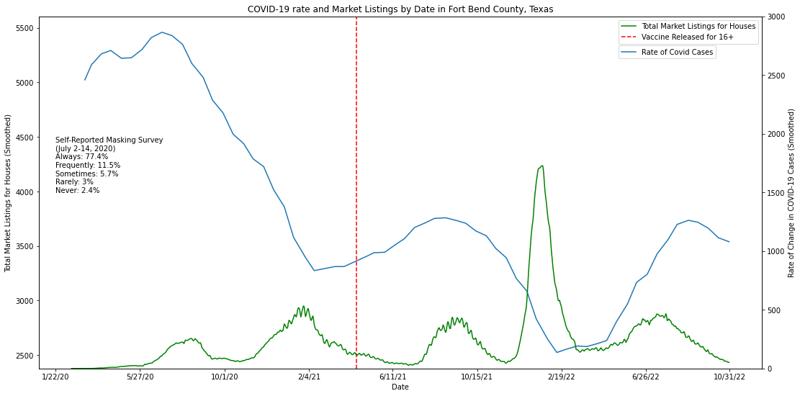

 
 

# DATA-512-Project
## Keegan Freeman
### 12/10/22

## Project Description
### Project Part 2
The goal of this project is to analyze how total housing listing count was affected by the COVID-19 pandemic with a scope limited to Fort Bend County, Texas. Ideally, this project will allow reviewers to draw inferences from the results such to formulate conclusions to be tested against others in a pragmatic ethical fashion. 

### Research Question
How were total housing market listings influenced by the COVID-19 pandemic?
### Hypotheses
**Hypothesis 1:** I predict that a time lag of two months will occur between the slope of confirmed COVID-19 cases and total market listings present in Fort Bend County, Texas
**Hypothesis 2:** I predict every 25% change in the slope of confirmed COVID-19 cases will result in a 5% decrease in total market listings in Fort Bend County, Texas. 

### Project Part 1
The goal of this project portion is to analyze how masking policies altered the progression of COVID-19 in Fort Bend County, Texas. Unfortunately, there were no mandates put in place for this specific county, so instead I focused on plotting the total-confirmed cases alongside their derivation. Additionally, I included the breakpoints for the data as well as the date of the COVID-19 vacination rollout. Lastly, the self-reported statistics from [this](https://github.com/nytimes/covid-19-data/tree/master/mask-use) survey are included within the plot as well.

## Files included
| File                                 | Description                                      |
| ------------------------------------ | ------------------------------------------------ |
| Project Extension Analysis.ipynb     | Notebook of Fort Bend Covid-19 Full Analysis     |
| Project Part 1.ipynb                 | Notebook of Initial Analysis                     |
| RAW_us_confirmed_cases.csv           | Contains confirmed covid-19 cases for the U.S.   |
| mask-use-by-county.csv               | Contains self-reported masking habits by county  |
| housing.csv                          | Contains total market housing listings           |
| Fort_Bend_Covid_Analysis.png         | Output Image of Fort Bend Covid-19 Analysis Pt.1 |
| Market Listing vs Covid.png          | Findal Output Image Analysis                     |

*Data Note: U.S._State_and_Territorial_Public_Mask_Mandates.csv is too large to be uploaded; however it can be found [here](https://data.cdc.gov/Policy-Surveillance/U-S-State-and-Territorial-Public-Mask-Mandates-Fro/62d6-pm5i).*

## Output Image of Fort Bend County Covid-19 Analysis Pt. 1

## Output Image of Fort Bend County Covid-19 Final Analysis

